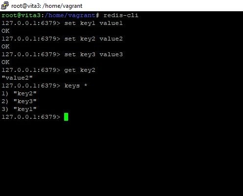
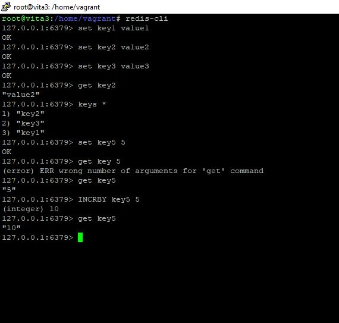

# Домашнее задание к занятию 2 "Кеширование Redis/memcached" - Лебедев Алексей, fops-10

---

### Задание 1. Кеширование

- Приведите примеры проблем, которые может решить кеширование.
  

*Приведите ответ в свободной форме.*

### Ответ:      

Я выделил для себя три основных пункта:  
 - Уменьшение нагрузки на базу данных.
 - Ускорение доступа к данным
 - Снижение задержек при обработке

  
  

    

### Задание 2. Memcached 

- Установите и запустите memcached.

*Приведите скриншот systemctl status memcached, где будет видно, что memcached запущен.*
  ### Решение:

- Пробуем установить memcached (в моем случае, уэе установлен в системе), проверяем службу и пробуем подключиться на порт через telnet:

  
   

Пока все хорошо, идем дальше.  

### Задание 3. Удаление по TTL в Memcached    

Запишите в memcached несколько ключей с любыми именами и значениями, для которых выставлен TTL 5.  

*Приведите скриншот, на котором видно, что спустя 5 секунд ключи удалились из базы.*

- Снова прорвемся по telnet в memcached и создадим при помощи команды set несколько ключей с неким значением myvalue и (сначала) со временем жизни в 120 секунд. Для извлечения значений будем использовать куманду get:

   

- Пока я добавлял новый коммит, мои 120 секунд истекли и мы можем попробовать получить значения ключей снова (думаю, это не противоречит условию поставленной задачи:

    

В команде set мы записываем в строку следующие параметры - **set <key> <flags> <exptime> <bytes>**, где flags - это некий флаг, который говорит нам о свойстве записи (я так это понял), exptime - ttl, bytes - размер записи в байтах.

### Задание 4. Запись данных в Redis  

Запишите в Redis несколько ключей с любыми именами и значениями.  

*Через redis-cli достаньте все записанные ключи и значения из базы, приведите скриншот этой операции.*    

### Задание 5*. Работа с числами  
Запишите в Redis ключ key5 со значением типа "int" равным числу 5. Увеличьте его на 5, чтобы в итоге в значении лежало число 10.  

*Приведите скриншот, где будут проделаны все операции и будет видно, что значение key5 стало равно 10.*

### Решение:  

 - Для начала установим redis используя команду **apt install redis-server -y**. Службы проверены и работают. Приступаем к нашему заданию.
 - Зададим три ключа с рандомными значениями и выведем их. Мы можем вывести значения, как отдельного ключа, так и всех, используя команду **keys***:

   

  - Теперь зададим ключ **key5** и дадим ему значение **5**. Для увеличения ключа на 5 используем команду **INCRBY**(increase by). Относительно параметра integer, гугл говорит, что redis НЕ требует явного указания типа данных при определении значения. Тем не менее, мы видим тип, когда используем команду **INCRBY**:

   
   

  
